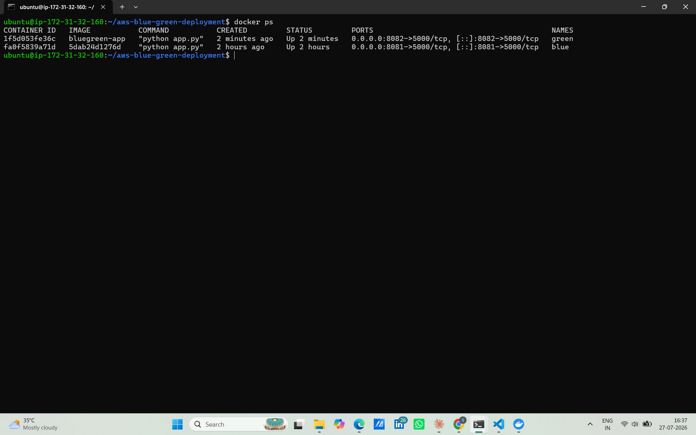
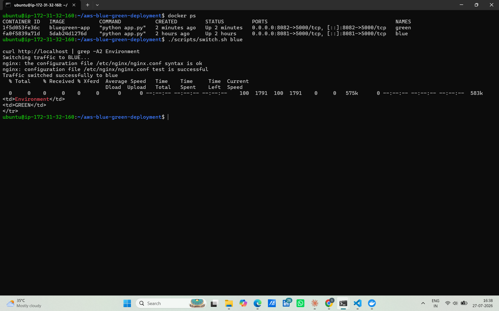
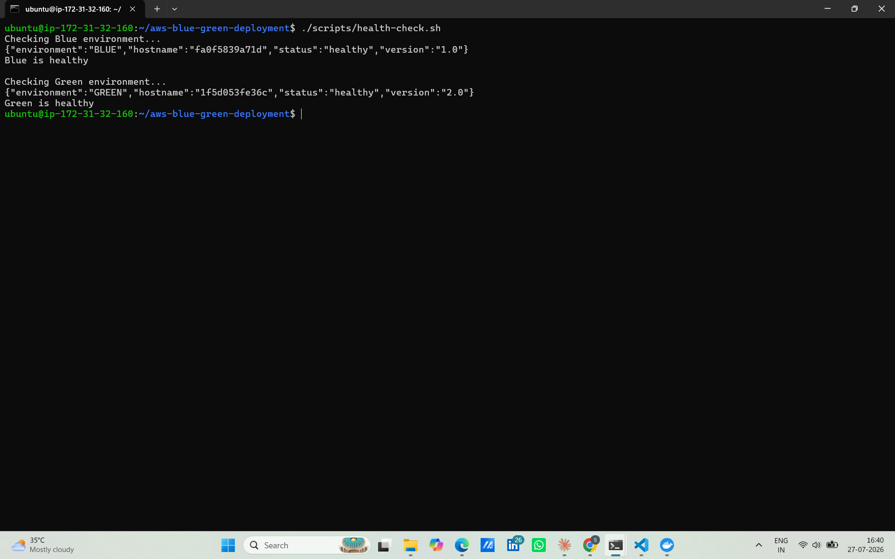
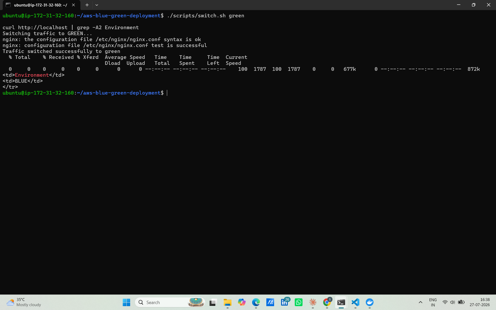
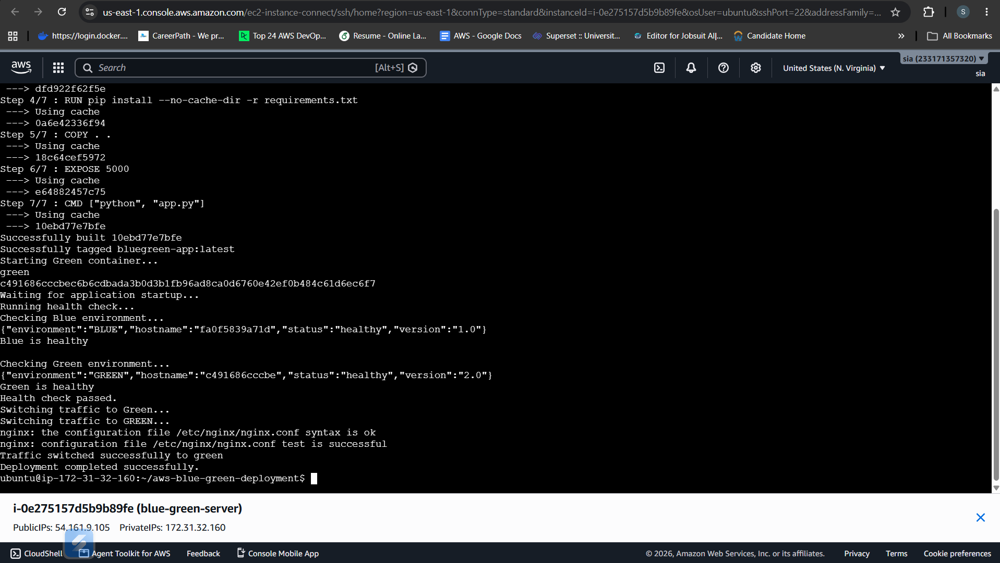

# 🚀 AWS Blue-Green Deployment using Docker, Nginx & GitHub Actions

<p align="center">


</p>

---

# 📌 Project Overview

This project demonstrates a **production-style Blue-Green Deployment** on **AWS EC2** using **Docker**, **Nginx**, and **GitHub Actions**.

Whenever new code is pushed to GitHub, GitHub Actions automatically deploys the application to the inactive environment, verifies its health, and switches live traffic using Nginx. This enables **minimal downtime deployments** and provides a reliable CI/CD workflow.

---

# 🏗️ Architecture

```text
                 Developer
                     │
              git push origin main
                     │
                     ▼
            GitHub Repository
                     │
                     ▼
          GitHub Actions CI/CD
                     │
              SSH Deployment
                     │
                     ▼
             AWS EC2 (Ubuntu)
                     │
      ┌──────────────┴──────────────┐
      │                             │
      ▼                             ▼
 Blue Docker Container       Green Docker Container
      │                             │
      └──────────────┬──────────────┘
                     ▼
             Nginx Reverse Proxy
                     │
                     ▼
                 End Users
```

---

# ✨ Features

- Production-style Blue-Green Deployment
- Automated CI/CD using GitHub Actions
- Dockerized Flask Application
- AWS EC2 Deployment
- Nginx Reverse Proxy
- Health Check Endpoint
- Automated Traffic Switching
- Minimal Downtime Deployment
- Linux Server Administration

---

# 🛠️ Technology Stack

| Category | Technologies |
|----------|--------------|
| Cloud | AWS EC2 |
| CI/CD | GitHub Actions |
| Containers | Docker |
| Reverse Proxy | Nginx |
| Backend | Python Flask |
| Operating System | Ubuntu Linux |
| Version Control | Git & GitHub |

---

# 📂 Project Structure

```text
aws-blue-green-deployment
│
├── app/
│   ├── app.py
│   ├── Dockerfile
│   └── requirements.txt
│
├── nginx/
│   ├── nginx.conf
│   ├── blue.conf
│   └── green.conf
│
├── screenshots/
│
├── .github/
│   └── workflows/
│       └── deploy.yml
│
├── docker-compose.yml
├── README.md
├── LICENSE
└── .gitignore
```

---

# ⚙️ Deployment Workflow

1. Developer pushes code to GitHub.
2. GitHub Actions CI/CD pipeline starts automatically.
3. Workflow connects securely to the AWS EC2 instance.
4. Docker builds and deploys the latest application.
5. Health check validates the deployment.
6. Nginx switches traffic to the healthy environment.
7. Users access the updated application with minimal downtime.

---

# ❤️ Health Check

**Endpoint**

```text
/health
```

**Example Response**

```json
{
    "status":"healthy",
    "version":"1.0",
    "environment":"GREEN"
}
```

---

# 📸 Project Screenshots

## GitHub Actions CI/CD Pipeline


---

## Workflow Execution History


---

## Blue & Green Docker Containers



---

## Nginx Traffic Switch



---

## Application Health Check



---

## Successful Deployment



---

## End-to-End Deployment



---

# 💼 Skills Demonstrated

- AWS EC2
- Docker
- GitHub Actions
- CI/CD Automation
- Nginx
- Linux Administration
- SSH
- Blue-Green Deployment
- Flask
- Git
- Python

---

# 🚀 Future Enhancements

- Kubernetes (Amazon EKS)
- Terraform Infrastructure as Code
- Prometheus Monitoring
- Grafana Dashboards
- AWS Application Load Balancer
- SSL using Let's Encrypt
- Amazon CloudWatch Monitoring

---

# 📚 Key Learnings

- Implemented Blue-Green deployment strategy.
- Automated deployments using GitHub Actions.
- Managed Docker containers on AWS EC2.
- Configured Nginx as a reverse proxy.
- Performed health checks before switching production traffic.
- Improved deployment reliability with minimal downtime.

---

# 👩‍💻 Author

**Supraja**

DevOps Engineer

**Skills:** AWS • Docker • GitHub Actions • Linux • Nginx • Python • Flask • CI/CD

---

## ⭐ Support

If you found this project helpful, consider giving it a ⭐ on GitHub.
