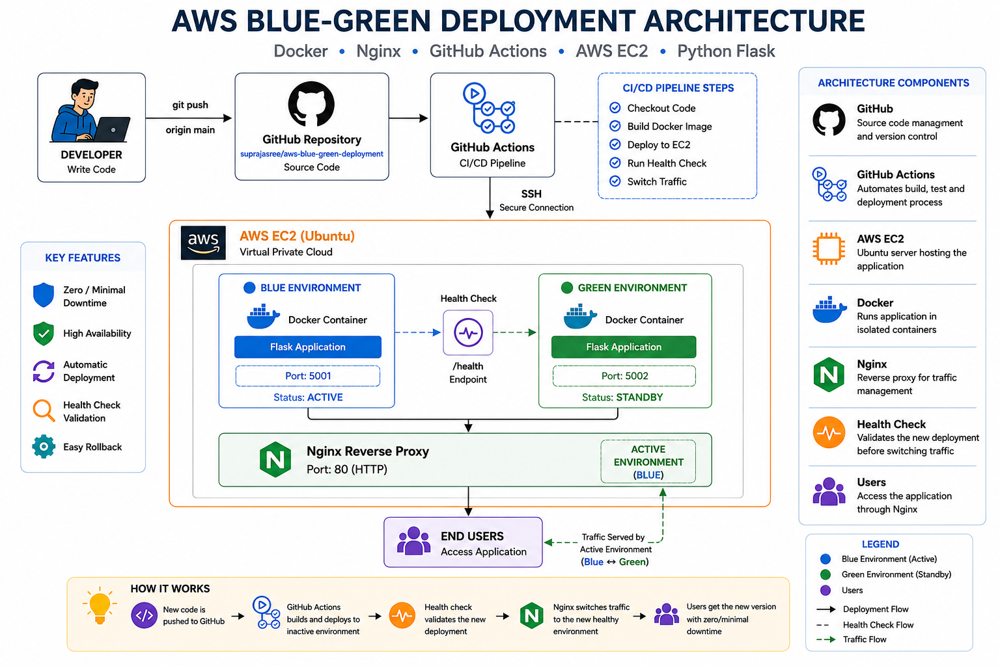

# 🚀 AWS Blue-Green Deployment using Docker, Nginx & GitHub Actions

[](https://github.com/suprajasree/aws-blue-green-deployment/actions/workflows/deploy.yml)


---

# 📌 Project Overview

This project demonstrates a **production-ready Blue-Green Deployment** strategy using **AWS EC2**, **Docker**, **Nginx**, and **GitHub Actions**.

The CI/CD pipeline automatically deploys every new GitHub commit to the inactive environment, performs application health checks, and switches production traffic using Nginx. This deployment approach minimizes downtime, improves release reliability, and supports safe production deployments.

---

# 🏗️ Architecture

<p align="center">
  
</p>

---

# ✨ Features

- 🚀 Blue-Green Deployment Strategy
- ⚙️ Automated CI/CD using GitHub Actions
- 🐳 Dockerized Flask Application
- ☁️ AWS EC2 Deployment
- 🌐 Nginx Reverse Proxy
- ❤️ Automated Health Checks
- 🔄 Zero / Minimal Downtime Deployment
- 🔐 Secure SSH Deployment
- 🐧 Linux Server Administration

---

# 🛠️ Technology Stack

| Category | Technologies |
|-----------|--------------|
| Cloud | AWS EC2 |
| CI/CD | GitHub Actions |
| Containers | Docker |
| Reverse Proxy | Nginx |
| Backend | Python Flask |
| Operating System | Ubuntu Linux |
| Version Control | Git & GitHub |

---

# 📂 Project Structure

```text
aws-blue-green-deployment/
│
├── app/
│   ├── app.py
│   ├── Dockerfile
│   └── requirements.txt
│
├── nginx/
│   ├── nginx.conf
│   ├── blue.conf
│   └── green.conf
│
├── architecture/
│   └── aws-blue-green-architecture.png
│
├── screenshots/
│   ├── 01-health-check.png
│   ├── 02-blue-green-containers.png
│   ├── 03-nginx-traffic-switch.png
│   ├── 04-end-to-end-deployment.png
│   ├── 05-github-actions-pipeline.png
│   ├── 06-workflow-history.png
│   └── 07-green-environment.png
│
├── .github/
│   └── workflows/
│       └── deploy.yml
│
├── docker-compose.yml
├── README.md
├── LICENSE
└── .gitignore
```

---

# 🔄 CI/CD Workflow

```text
Developer
    │
    ▼
Git Push
    │
    ▼
GitHub Repository
    │
    ▼
GitHub Actions
    │
    ▼
SSH to AWS EC2
    │
    ▼
Docker Build & Deploy
    │
    ▼
Blue / Green Containers
    │
    ▼
Health Check
    │
    ▼
Nginx Traffic Switch
    │
    ▼
Production Users
```

---

# ❤️ Health Check

### Endpoint

```text
/health
```

### Sample Response

```json
{
  "status": "healthy",
  "version": "1.0",
  "environment": "GREEN"
}
```

---

# 📸 Project Screenshots

## GitHub Actions CI/CD Pipeline


---

## Workflow Execution History


---

## Blue & Green Docker Containers


---

## Nginx Traffic Switching


---

## Application Health Check


---

## End-to-End Automated Deployment


---

## Production Traffic Switched to Green Environment


---

# 💼 Skills Demonstrated

- AWS EC2
- Docker
- GitHub Actions
- CI/CD Automation
- Nginx Reverse Proxy
- Linux Administration
- SSH Deployment
- Blue-Green Deployment
- Python
- Flask
- Git

---

# 📚 Key Learning Outcomes

- Implemented Blue-Green deployment on AWS EC2.
- Built an automated CI/CD pipeline using GitHub Actions.
- Deployed Docker containers with minimal downtime.
- Configured Nginx as a reverse proxy.
- Implemented health checks before switching production traffic.
- Improved deployment reliability using automated traffic routing.

---

# 🚀 Future Enhancements

- Kubernetes (Amazon EKS)
- Terraform Infrastructure as Code
- Prometheus Monitoring
- Grafana Dashboards
- AWS Application Load Balancer
- Let's Encrypt SSL
- Amazon CloudWatch Monitoring

---

# 👩‍💻 Author

## Supraja

**DevOps Engineer**

**Tech Stack:** AWS • Docker • GitHub Actions • Linux • Nginx • Python • Flask • CI/CD

---

## ⭐ Support

If you found this project useful, please consider giving it a ⭐ on GitHub.