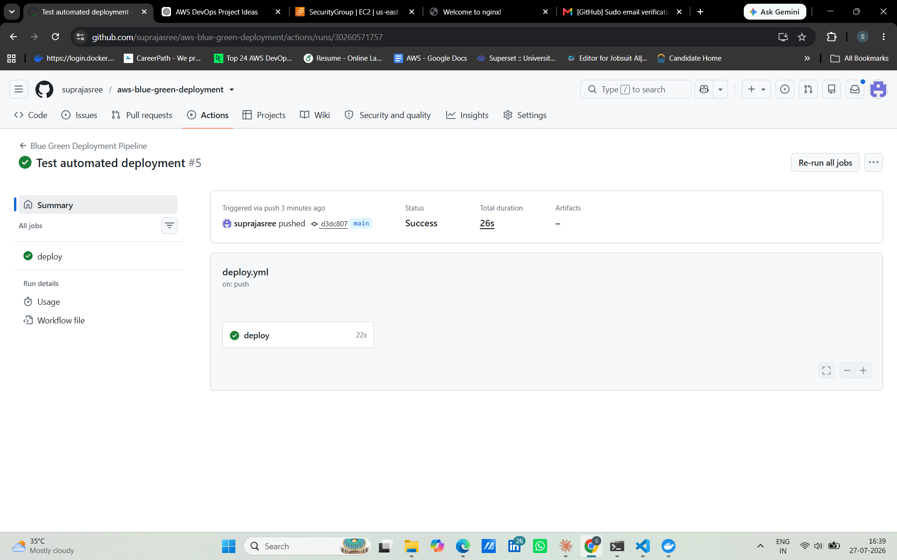
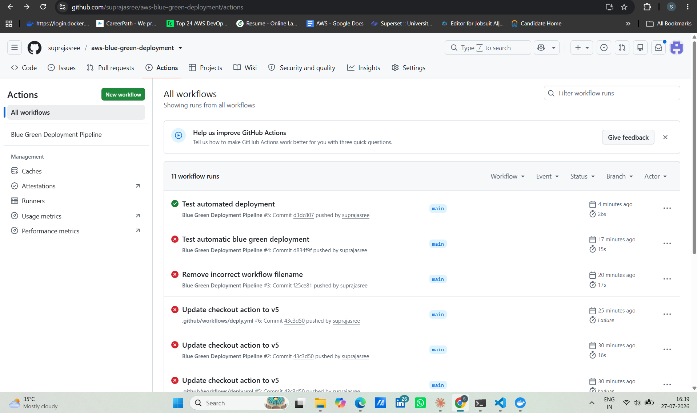

# 🚀 AWS Blue-Green Deployment using Docker, Nginx & GitHub Actions

<p align="center">


</p>

---

# 📌 Project Overview

This project demonstrates a **production-style Blue-Green Deployment** strategy using **AWS EC2**, **Docker**, **Nginx**, and **GitHub Actions**.

The CI/CD pipeline automatically deploys every new GitHub commit to the inactive environment, performs a health check, and switches production traffic using Nginx. This deployment approach minimizes downtime and reduces deployment risk.

---

# 🏗️ Architecture

```text
                    👨‍💻 Developer
                          │
                   git push origin main
                          │
                          ▼
                  GitHub Repository
                          │
                          ▼
                 GitHub Actions CI/CD
                          │
                     SSH Deployment
                          │
                          ▼
                   AWS EC2 (Ubuntu)
                          │
             ┌────────────┴────────────┐
             │                         │
             ▼                         ▼
      🔵 Blue Docker App        🟢 Green Docker App
             │                         │
             └────────────┬────────────┘
                          ▼
                 Nginx Reverse Proxy
                          │
                          ▼
                      🌍 End Users
```

---

# ✨ Features

- ✅ Blue-Green Deployment Strategy
- ✅ Automated CI/CD Pipeline
- ✅ Dockerized Flask Application
- ✅ AWS EC2 Deployment
- ✅ Nginx Reverse Proxy
- ✅ Health Check Validation
- ✅ Automated Traffic Switching
- ✅ Minimal Downtime Deployment
- ✅ Linux Server Administration

---

# 🛠️ Technology Stack

| Category | Technologies |
|-----------|--------------|
| Cloud | AWS EC2 |
| CI/CD | GitHub Actions |
| Containerization | Docker |
| Reverse Proxy | Nginx |
| Backend | Python Flask |
| Operating System | Ubuntu Linux |
| Version Control | Git & GitHub |

---

# 📂 Project Structure

```text
aws-blue-green-deployment/
│
├── app/
│   ├── app.py
│   ├── Dockerfile
│   └── requirements.txt
│
├── nginx/
│   ├── nginx.conf
│   ├── blue.conf
│   └── green.conf
│
├── screenshots/
│
├── .github/
│   └── workflows/
│       └── deploy.yml
│
├── docker-compose.yml
├── README.md
├── LICENSE
└── .gitignore
```

---

# ⚙️ CI/CD Workflow

1. Developer pushes code to GitHub.
2. GitHub Actions workflow starts automatically.
3. The workflow securely connects to the AWS EC2 instance via SSH.
4. Docker builds and deploys the latest application version.
5. The application health is verified.
6. Nginx switches production traffic to the healthy environment.
7. Users access the updated application with minimal downtime.

---

# ❤️ Health Check

### Endpoint

```text
/health
```

### Sample Response

```json
{
  "status": "healthy",
  "version": "1.0",
  "environment": "GREEN"
}
```

---

# 📸 Project Screenshots

## GitHub Actions CI/CD Pipeline



---

## Workflow Execution History



---

## Blue & Green Docker Containers


---

## Nginx Traffic Switching


---

## Application Health Check


---

## End-to-End Deployment


---

## Production Traffic Switched to Green Environment


---

# 💼 Skills Demonstrated

- AWS EC2
- Docker
- GitHub Actions
- CI/CD Automation
- Nginx Reverse Proxy
- Linux Administration
- SSH Deployment
- Blue-Green Deployment
- Flask
- Python
- Git

---

# 📚 Key Learning Outcomes

- Implemented a Blue-Green deployment strategy.
- Built an automated CI/CD pipeline with GitHub Actions.
- Deployed Docker containers on AWS EC2.
- Configured Nginx as a reverse proxy.
- Performed health checks before production traffic switching.
- Reduced deployment downtime using automated traffic routing.

---

# 🚀 Future Enhancements

- Amazon EKS (Kubernetes)
- Terraform Infrastructure as Code
- Prometheus Monitoring
- Grafana Dashboards
- AWS Application Load Balancer
- Let's Encrypt SSL
- Amazon CloudWatch Monitoring

---

# 👩‍💻 Author

## Supraja

**DevOps Engineer**

**Skills:** AWS • Docker • GitHub Actions • Linux • Nginx • Python • Flask • CI/CD

---

## ⭐ Support

If you found this project useful, please consider giving it a ⭐ on GitHub.